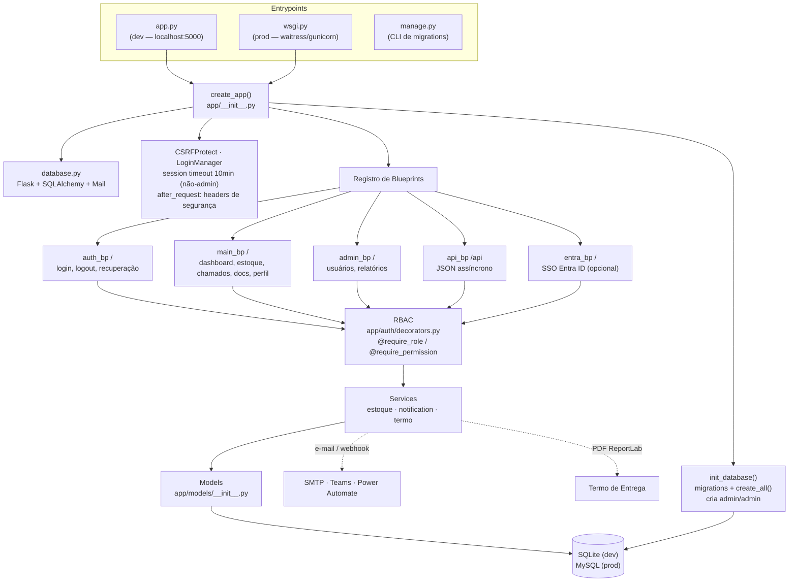
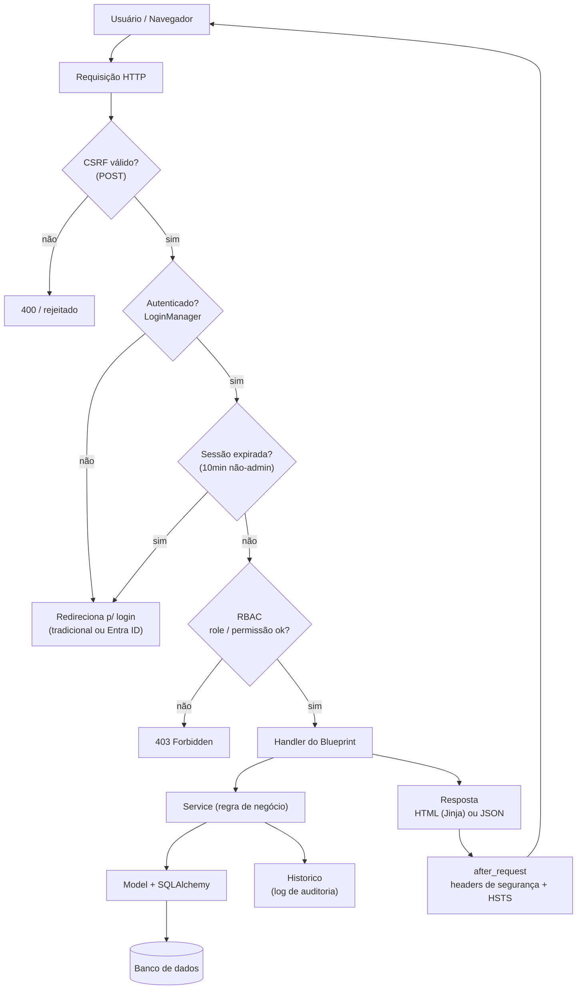
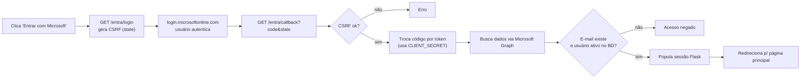

# Arquitetura — Sistema ESTOQUE

Visão geral em fluxogramas. O detalhamento de cada componente está no `CLAUDE.md` (raiz)
e na própria estrutura de `app/`. Este documento explica *como as peças se conectam* —
não substitui a leitura do código.

## 1. Arquitetura e inicialização

## 2. Fluxo de uma requisição

## 3. Fluxo de autenticação SSO (Entra ID)

Detalhes do SSO em [entra-id/README.md](entra-id/README.md) e [entra-id/SETUP.md](entra-id/SETUP.md).
